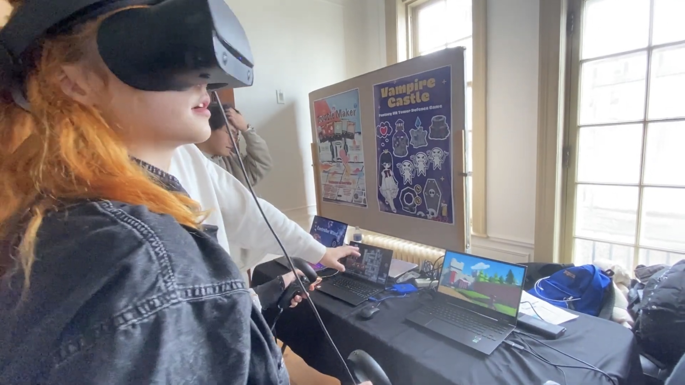
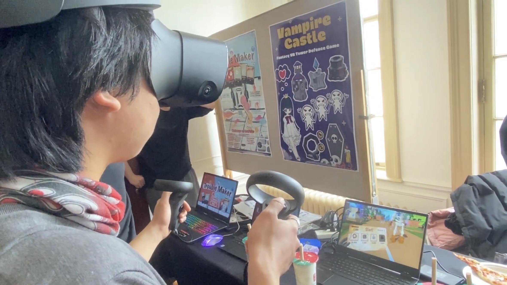
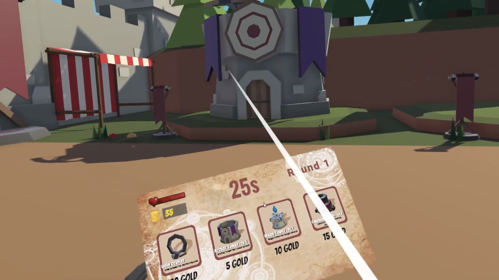
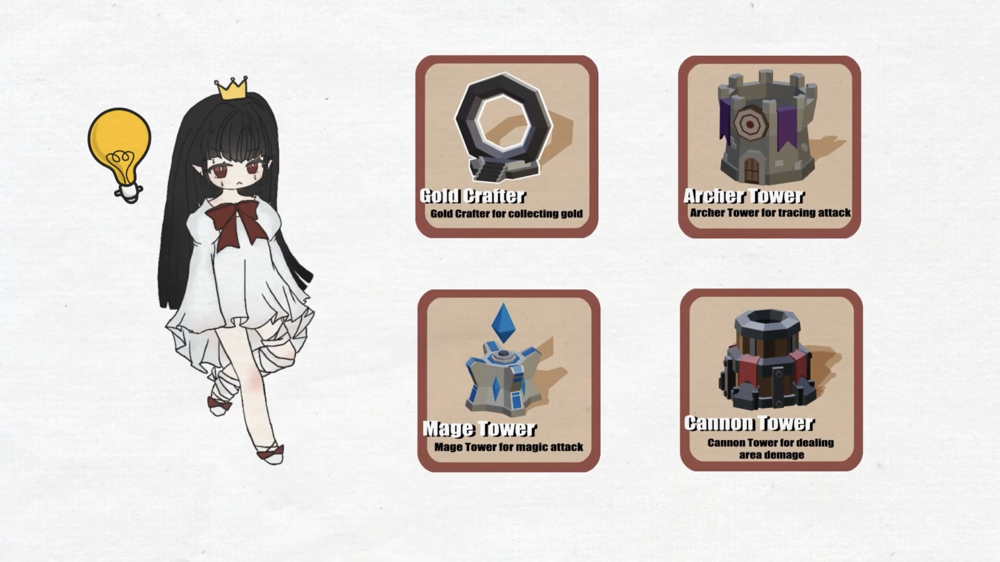

# Vampire Castle 3D VR Game
A first-person perspective 3D VR tower defense game is available exclusively on Windows PC.

## Project Description 
- **Project Type**: 
Bachelor School Project in Queen's University CISC 496 - VR Tower Defense Game.
  
- **Project Motivations**:  
Combining Tower Defence, 3D, and VR features would be really interesting because the game strategy and gameplay will be very different. Players can only see a small portion of the map instead of an overhead view.

## Project Summary
- **Completed Functionalities**: 
  Character movement and viewpoint control. 
  Enemy movement paths. 
  Building Towers and Destory Towers. 
  UI elements including the main interface, tower selection, and round number. 
  Gameplay mechanics implemented with C# scripts. 
  
- **Project Goal**: 
To develop an engaging VR tower defense game that combines strategic gameplay, immersive environments, and resource management. The game encourages players to think strategically about tower placement and upgrades to fend off waves of enemies and protect the heart.
  
- **Language Package**: 
**Developing Tool**: *Unity*  
**Developing Language**: *C#*  
**Design Tool**: *Blender, Mixamo, Procreate* 

## Project Feature
**1. First-Person Perspective VR Gameplay**

  
  
  

Players control their characters using VR handle operation. The immersive first-person perspective enhances the player's engagement with the game environment and the strategic elements of tower placement.  

**2. Educational Tutorial System**

  
  

A detailed tutorial system helps players understand the controls, objectives, and mechanics of the game, ensuring a smooth learning curve and an enjoyable experience from the start.  

**3. Strategic Tower Defense Mechanics**

  
  
  
  

Players can place various types of towers along the road to attack and block enemies. These towers are immune to enemy attacks and require gold coins to build. At the start of the game, players are given only 40 coins, so choosing which tower to build initially is crucial. Since players can only see a small part of the map, they need to explore the map in the first few rounds to prepare for later levels. As the difficulty increases with each level, players may need to destroy previously built towers and replace them with new ones to win the game.  

**4. Resource Management**

  
  
  

At the start of the game, players are given 40 gold coins. Gold coins are crucial for building towers. Players need to collect coins dropped by defeated enemies and produced by towers.

**5. Diverse Tower Types**

  
  
  
  
  

Gold Crafter: Collecting gold (3 gold/30 seconds).  
Archer Tower: Tracing attack with (damage 5). 
Mage Tower: Magic attack and slow down speed (damage 10). 
Cannon Towers: Area attack (20 damage).  

**6. Enemy Dynamics**

  

Enemies move along a set path towards the heart. Players must strategically place towers to prevent enemies from reaching and destroying the heart. Different enemy types, including small and large monsters, have varying HP and drop different amounts of gold coins upon defeat.   

- **Environment Setup**: 
To run the project, you need to set up the following environment:  
**1. Prerequisites**: 
**Operating System**: Windows PC.  
**VR Headset**: Meta Quest 2, Oculus Rift S, or any OpenXR-compatible headset with connected controllers.  
**2. Setup Instructions**: 
**Clone Repository**: Clone the project repository from GitHub. 
**Connect VR Headset**: Connect any version of Meta headset (or any OpenXR headset) to your PC. 
**Load Headset**: Ensure your headset is fully loaded and can display your PC desktop. 
**Launch Game**: Open the *Vampire Castle.exe file* from your PC to launch the game, but do not wear the headset yet. 
**Start Game**: Using your mouse, click the 'Start Game' button on your PC screen. You should see a white ground scene displayed on your PC. 
**Wear Headset and Ready to Play**:  Now, wear the VR headset. You are now ready to play the game! 

## Game Controls
- **Movement**: Left Joystick to move; Right Joystick to rotate.
- **Open Hand Menu**: Lower Button (A)
- **Build Tower/ Destroy Tower**: Upper Button (B)
- **Collect Coins**: Walk over coins to collect them.

## Iterative Design
- **Unit Test**:
Implemented unit tests to ensure the reliability of game mechanics, including character movement, tower functionality, and enemy behavior. Gathered feedback from initial players to refine the game. Additionally, 15 players tested the application for 3 rounds, providing valuable feedback for further improvements. 

- **Improvements**: 
**Mitigate Cybersickness**: 
All the players suffered from cybersickness during the game. We try to mitigate cybersickness by using consistent light, a high frame rate, a stable horizon, and reduced acceleration. 
**Expanded Tutorial and Help System**: 
As it's the first time for some players to use a VR handler, I expanded the tutorial to be more interactive and segmented, guiding players through each gameplay mechanic step-by-step. 
**Clear Indicators**: 
Introduce clear visual indicators for important events, such as tower readiness, enemy waves, and resource availability, to help players stay informed. 
**Reduce the Number of Levels**:   
The majority of players can only play the game for 30 minutes due to cybersickness so we reduced the number of levels.  
**Game Balance**: 
Decrease the damage for Mage Tower and increase the coin production rate for Gold Crafter.

## Video Demo

 * video link: [https://www.youtube.com/watch?v=SeSH-yGvLrM](https://www.youtube.com/watch?v=c2cYV-YtA-w&t=4s)
